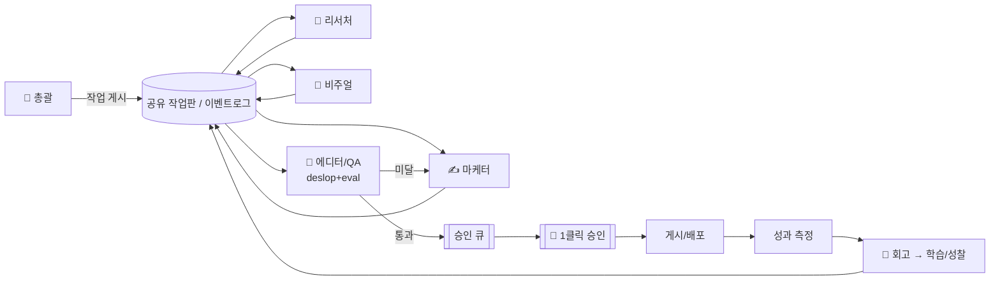

# 260613 Dewy 에이전트 오피스 — 심화 설계 (자율 고도화 · 품질 · 개입 최소)

> 목표: 에이전트 '직원'들이 **서로 소통하며 자율적으로 사업을 고도화**하되, **품질을 지키고
> 내 개입은 최소화**. 1인 운영 pre-beta(CS ~50건/월, AI 예산 $50–200/월) 기준.
> 근거: 2026 업계 리서치(하단 출처) + 1차 분석(`260613_agent_automation_research.md`).

## 0. 설계 원칙 (업계 근거 5)

1. **거버넌스 > 모델 능력.** 2026 agentic 프로젝트의 **40%가 2027까지 취소 전망**(비용·복잡도·리스크).
   구매 기준이 '능력'에서 '신뢰·감사추적·통제'로 이동. → **가볍게, 감사가능하게.**
2. **단일 고레버리지 HITL 게이트.** 사람을 발행 승인 한 점에만 → 완전자동 대비 **오류 73%↓**.
3. **소통 = MCP(도구) + 경량 자체 버스(에이전트간).** A2A(구글→Linux재단, MCP와 함께 AAIF 표준)는
   인지하되 **인프라 도입은 보류**(에이전트 2~4명엔 과설계). 표준만 따라가다 필요 시 채택.
4. **자기개선 = Reflexion + eval 루프.** 실패/저평가를 **영속 메모리에 자연어 성찰**로 누적,
   트레이스로 프롬프트·프리셋 개선. 단순 재시도와 다름.
5. **관측 = 모든 스텝 트레이스 + 골든셋 + LLM-judge.** "고객 불만 후"가 아니라 "회귀 즉시" 잡기.

## 1. 에이전트 조직도 & 소통

### 직원(역할)
| 에이전트 | 모델 | 역할 |
|---|---|---|
| 🧭 총괄(오케스트레이터) | Haiku | 작업 라우팅·위임·큐 관리 |
| 🔎 리서처 | Sonnet+browser-use | 시장·경쟁·**한국 커뮤니티** 리서치(API 없는 영역) |
| ✍️ 마케터 | Sonnet | 블로그/숏폼 카피 |
| 🎨 비주얼 | Higgsfield | 이미지/숏폼(조명 프리셋) |
| 🧹 에디터/QA | Haiku | deslop + 룰체크 + eval 점수(사람 전 자동 검수) |
| 🔁 회고 | Sonnet | 주간 성과·실패 분석 → 개선 제안 |
| (로드맵) 🛟 CS · 🔒 보안 | — | 볼륨 늘면 가동 |

### 소통 방식 — "공유 작업판(blackboard) + 이벤트 로그"
- **runlog 를 이벤트 버스로 진화**: 에이전트가 작업을 **게시(post)/구독(subscribe)**. 메시지 스키마
  `{from, to, type, ref, payload, status}`. append-only → 그대로 **감사 추적**이 됨.
- 패턴: **매니저-워커 + 블랙보드**(공유 메모리). 총괄이 작업을 보드에 올리면 해당 워커가 집어 처리,
  결과를 다시 보드에 → 다음 워커(예: 마케터→에디터→비주얼)가 이어받음. 직접 호출 대신 보드 경유라
  느슨한 결합·재시도·관측이 쉬움.
- **MCP**로 도구(Higgsfield·Supabase·검색) 연결. **A2A**는 외부 에이전트 연동이 필요해질 때.

## 2. 자율 고도화 루프 (사업을 키우는 닫힌 고리)

리서치 → 아이디어 → 초안·비주얼 → **자기검토(eval)** → 승인큐 → **(사람 1클릭)** → 게시 →
**성과측정** → **성찰·학습** → 프롬프트·프리셋·타깃 개선 → (다시 리서치).

- **주간 회고 에이전트**가 runlog + 성과(클릭·전환)를 읽고 "무엇이 먹혔나/안 먹혔나"를
  분석해 **개선 제안**(카피 톤, 조명 프리셋, 발행 시간대, 타깃 키워드)을 큐로 → 사람 승인 후 반영.
- **Reflexion 메모리**(`learnings.md`, 영속): 반려·저평가 건은 자연어 성찰로 누적 →
  다음 생성 컨텍스트에 주입 → 같은 실수 반복 차단(GUARDRAILS.md 규약과 연동).

## 3. 품질 가드레일 — "개입 없이 품질 유지"

생성 직후, **사람에게 가기 전 자동 3중 게이트**(에디터/QA 에이전트):
1. **룰 체크**: deslop(em-dash·과장어휘·throat-clearing 제거), 금칙어, **사실 그라운딩**
   (업체·가격은 실데이터 근거 있는지 — 환각 차단), 분량/형식.
2. **LLM-as-judge 점수**: 톤(브랜드 보이스)·정확성·유용성 0–10. 임계 미달 자동 반려.
3. **골든셋 회귀**: 대표 brief 세트의 점수를 추적 → 프롬프트 변경이 품질을 떨어뜨리면 경보.

통과만 승인큐로. 미달은 **1회 자동 재생성** 후에도 미달이면 사람에게 "주의" 표시로.
런타임: PII 레닥션, **프롬프트 인젝션 방어**(스크랩 콘텐츠는 '데이터'로만, 행동지시 해석 금지).

## 4. 단일 인간 게이트 + 티어드 리뷰

| 위험도 | 예 | 처리 |
|---|---|---|
| 저 | 내부 리서치 요약 | eval 통과 시 **자동** |
| 중 | 블로그/숏폼 초안 | 큐에서 **스팟체크 승인** |
| 고 | 공개 광고·외부 게시·결제·DB 변경 | **명시적 승인 필수** |

**섀도 모드 2주**: 처음엔 전부 큐에만. 신뢰가 쌓이면 저위험부터 자동화 확대.

## 5. 거버넌스 & 안전 (1인 운영 필수 — 40% 실패 원인 차단)

- **감사**: runlog append-only(스텝·모델·토큰·비용·결정). 모든 행동 재구성 가능.
- **GUARDRAILS.md**: 금지 행동·알려진 실패를 파일 규약으로(에이전트가 항상 로드).
- **비용 캡**(일/월) + **서킷브레이커**(에러율·비용 급증 시 자동 정지) + **킬 스위치**.
- **권한 최소화**: 자동 발행은 화이트리스트 채널만. 외부 쓰기는 큐 경유 사람 승인.

## 6. 기술 선택 (right-sizing — 과설계 경계)

- **지금 만들 것**: Python 오피스 + runlog(이벤트/감사) + **승인 큐** + **deslop/eval(자체 구현)** + MCP.
- **나중(트리거 명시)**: A2A(에이전트 다수·외부 연동 시) · 관측 SaaS(Braintrust/AgentOps, 볼륨↑ 시) ·
  n8n/Make(비개발 워크플로 늘 때).
- **안 할 것**: 무거운 ACP/멀티프레임워크 동시 운용, 상시 다중 crew, 무인 발행, 무제한 권한.

## 7. 로드맵 (단계 + 진입 트리거)

| 단계 | 내용 | 트리거/상태 |
|---|---|---|
| **P1** | 승인 큐 + 섀도 모드 + deslop | 지금 (개입 최소 핵심, 외부의존 0) |
| **P2** | 자기검토 eval(LLM-judge + 골든셋) | P1 후 — 품질 자동 방어 |
| **P3** | 리서처(browser-use, 한국 커뮤니티) + 성과 측정 | P2 후 — 인젝션 방어·결정론 페어링 |
| **P4** | 주간 회고/학습 루프(Reflexion + learnings.md) | P3 후 — 자율 고도화 닫힘 |
| **P5** | (조건부) A2A·관측 SaaS·n8n | 볼륨/복잡도 임계 도달 시에만 |

## 8. 성공 지표

주당 내 개입 시간 ↓ · 큐 eval 통과율 · 골든셋 점수 추세 · 게시당 성과(클릭/전환) ·
산출물당 비용 · **사고 0**(잘못 발행·예산 폭주·인젝션). 40% 실패의 길로 가지 않는지 분기 점검.

## 출처
- [MCP vs A2A 멀티에이전트 협업 2026 (OneReach)](https://onereach.ai/blog/guide-choosing-mcp-vs-a2a-protocols/)
- [A2A 표준 현황 2026 (Programming Helper)](https://www.programming-helper.com/tech/agent-to-agent-protocol-2026-google-a2a-standard)
- [Agentic AI in Production: 멀티에이전트 가드레일 2026 (Medium)](https://medium.com/@dewasheesh.rana/agentic-ai-in-production-designing-autonomous-multi-agent-systems-with-guardrails-2026-guide-a5a1c8461772)
- [Self-Evolving Agents 쿡북 (OpenAI)](https://developers.openai.com/cookbook/examples/partners/self_evolving_agents/autonomous_agent_retraining)
- [Self-Improving AI Agents 2026 (o-mega)](https://o-mega.ai/articles/self-improving-ai-agents-the-2026-guide)
- [AI Agent Guardrails 솔루션 2026 (Galileo)](https://galileo.ai/blog/best-ai-agent-guardrails-solutions)
- [Agent Observability 가이드 2026 (Braintrust)](https://www.braintrust.dev/articles/agent-observability-complete-guide-2026)
- [AI Agent Orchestration 가치 (Deloitte)](https://www.deloitte.com/us/en/insights/industry/technology/technology-media-and-telecom-predictions/2026/ai-agent-orchestration.html)
- [Digital Workforce 2026 (AutomationEdge)](https://automationedge.com/blogs/digital-workforce-2026-ai-automation-enterprises/)
