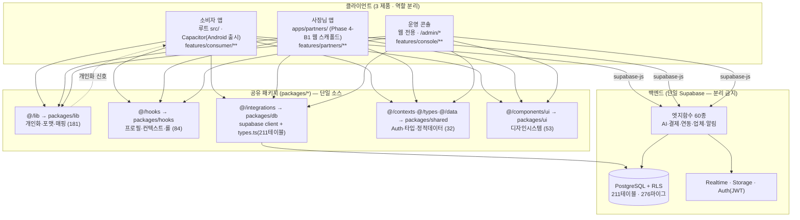
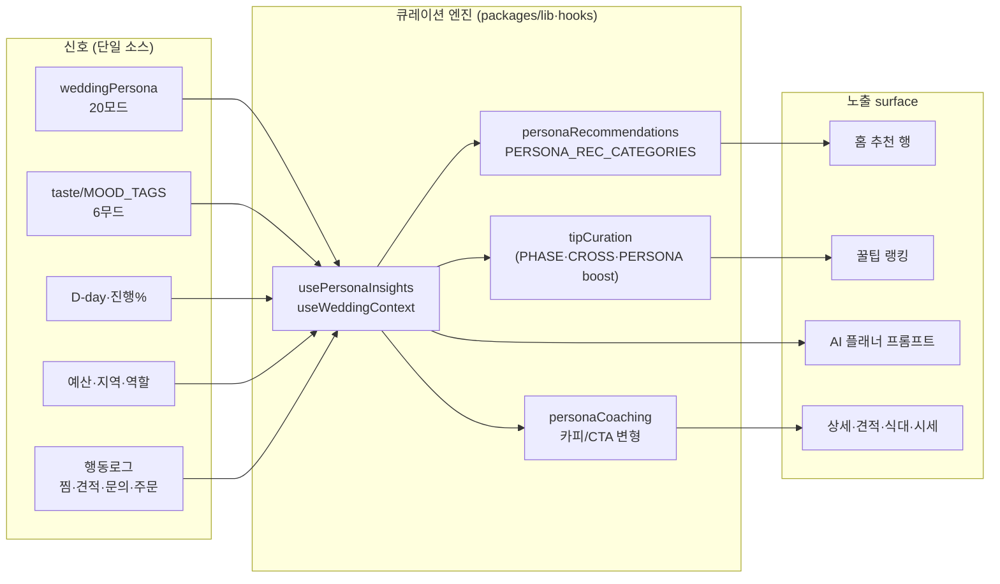
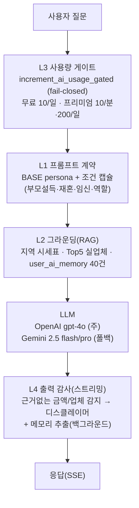

# 다음 세션 로드맵 — 전체 아키텍처 설계도 + 진행 계획 (260701)

> 작성 배경(사용자 요청): **"전체 아키텍쳐 먼저 파악하고 설계도 그린 후에 진행해줘."**
> 이 문서는 새 세션이 코드로 바로 들어가기 전에 **① 지금의 전체 구조를 실측으로 파악**하고
> **② 설계도(다이어그램)로 고정**한 뒤 **③ 무엇을 이어서 할지**를 우선순위로 정리한 단일 인계 문서다.
>
> 실측 기준(2026-07-01, `origin/main` 머지 반영): 마이그레이션 **276개** · 엣지함수 **60종** ·
> `types.ts` 테이블 **211개** · 소비자 페이지 **133파일**. 근거 문서: `docs/260624_app_separation_roadmap.md`
> (앱 분리) · `docs/260630_competitive_upgrade_plan.md`(경쟁 갭) · `docs/260629_partner_app_master_plan.md`
> (사장님 앱) · `docs/260701_codereview.md`(직전 감사).

---

## 0. TL;DR — 지금 어디에 있나

- **아키텍처는 "단일 레포"가 아니라 이미 모노레포 전환 중이다.** 문서(`260624`)는 Phase 4(모노레포)를
  "장기"로 적어뒀지만 **실제 코드는 Phase 4-A(공유 패키지 골격)까지 와 있고 4-B1(사장님 앱 스캐폴드)까지
  착수**했다. 새 세션은 이 **문서-현실 드리프트**를 먼저 인지해야 헛짚지 않는다(§2).
- **구조 = 3 제품 · 1 백엔드 · 5 공유 패키지.** 소비자(+운영자)는 루트 `src/`, 사장님은 `apps/partners/`,
  공유 로직은 `packages/{lib,hooks,db,shared,ui}` 로 물리 분리됐고 **import 경로(`@/lib` 등)는 alias
  리매핑으로 유지**돼 호출부 변경 0으로 코드만 이동했다(§1·§2).
- **다음 할 일은 두 트랙 병행**: **트랙 A(구조)** = 앱 분리 Phase 2→4-B→5 완주, **트랙 B(제품)** =
  경쟁 갭 Phase 2~3 나머지 + 개인화 심화. 우선순위·순서는 §3.
- **바로 코딩 금지(AGENTS 0·검증)**: 어떤 항목이든 착수 전 "DB 선확인 → 마이그 → types 재생성 →
  클라 → e2e" 게이트와 도메인 경계 린트를 통과한다(§4).

---

## 1. 전체 아키텍처 설계도

### 1-A. 시스템 개관 — 3 제품 · 1 백엔드 · 공유 패키지



**핵심 규칙**: 인가는 끝까지 **RLS**가 책임(클라 가드 `BusinessGuard`/`AdminGuard`는 UX용).
백엔드 Supabase 1개 공유(분리 금지). 세 feature 는 서로 직접 import 금지 — 공유는 `packages/*` 경유
(`eslint no-restricted-imports` + `scripts/check-integrity.mjs` 의 `{consumer,partners,console}-domain-boundary` 로 강제).

### 1-B. 모노레포 디렉토리 구조 (실측)

```
dewy/  (npm workspaces: apps/* + packages/*)
├── src/                         # 소비자 앱 루트 (+ console 마운트) · @ = src
│   ├── App.tsx                  # 라우팅 조립: 소비자 직접 + /business·/admin 은 라우트 모듈 lazy
│   ├── features/
│   │   ├── consumer/  (173)     # pages(133) · data(supabase 쿼리)
│   │   ├── partners/  (59)      # pages · routes.tsx(/business/*) · hooks · lib · data
│   │   └── console/   (90)      # pages · routes.tsx(/admin/*) · components(AdminGuard/Layout)
│   ├── components/              # 소비자 공용 UI(persona·home·invitation·detail·tutorial·guides…)
│   └── stores/                  # Zustand (필터·정렬 UI 상태)
├── apps/
│   └── partners/                # 사장님 앱 (Phase 4-B1) — 독립 App.tsx·main.tsx·vite.config
│                                #   partners 라우트만 마운트 + 독립 로그인(PartnerAuth)
├── packages/                    # 공유 (alias 로 @/lib·@/hooks·@/integrations·@/contexts·@/components/ui)
│   ├── lib/    (181)            # weddingPersona(20모드)·tasteTaxonomy(6무드)·tipCuration·
│   │                           #   personaRecommendations·priceFormat·regionalPriceGuide·agent·chatbot
│   ├── hooks/  (84)             # useWeddingProfile·usePersonaInsights·useUserRole·useBudget…
│   ├── db/     (7)              # supabase client + types.ts(진짜 스키마 소스, 211테이블)
│   ├── shared/ (32)             # AuthContext · types · 정적 data
│   └── ui/     (53)             # shadcn 기반 디자인시스템
├── supabase/
│   ├── functions/  (60)         # Deno 엣지함수 (+ _shared: cors·jwt·llm·supabase)
│   └── migrations/ (276 sql)
├── android/ · ios/              # Capacitor 네이티브 래퍼 (같은 dist 번들)
├── api/     (6)                 # SSR(_lib/ssr) — blog·guide 등
├── ml/      (16)                # tip-classifier 등 (Python)
├── agent-office/ (26)           # 개발/운영 에이전트 자동화 오피스
├── e2e/ · seed/ · content/ · scripts/ · docs/
```

> ⚠️ **alias 리매핑 주의(vite.config.ts:66-80)**: `@/lib`→`packages/lib/src`, `@/integrations`→`packages/db/src`,
> `@/components/ui`→`packages/ui/src`, `@/hooks`→`packages/hooks/src`, `@/contexts·@/types·@/data`→`packages/shared/src/*`,
> `@`→`src`. **더 구체적인 `@/integrations` 를 `@` 보다 먼저** 둬야 첫 매칭이 packages 로 간다. 즉
> `src/lib`·`src/integrations` 는 디스크에 없다 — grep 으로 안 나온다고 "없는 코드"로 오판 금지.

### 1-C. 개인화 엔진 — 신호 → 큐레이션 (제품의 핵심 베팅, AGENTS 차원14)



**개인화 깊이 사다리**: ①없음 → ②정렬/필터 → ③콘텐츠 큐레이션 → ④카피/CTA 변형 → ⑤생성형 맞춤·추천이유.
직전 감사(`260701_codereview §6`)에서 식대·시세 카드는 깊이 3~4 도달, **20모드 카피 확장은 이월**(§3-C).

### 1-D. AI/RAG 파이프라인 — L1~L5 환각차단 (`supabase/functions/ai-planner`)



정적 프롬프트(BASE+ALWAYS_ON)는 별도 시스템 메시지로 보내 **OpenAI 프롬프트 캐시** 히트(비용↓).
백엔드 도메인 그룹 전체: AI 생성 7 · 결제/IAP 8 · 청첩장 7 · 연동(Drive·Cal·Gmail) 9 · 업체/상품 5 ·
알림 3 · 마케팅 4 · 계정수명주기 3 (상세 `docs/audit-surface-map.md` E영역).

---

## 2. 현재 상태 진단 — 문서 vs 실제 (드리프트 경보)

| 항목 | 문서(260624 등)의 서술 | **실제 코드(260701 실측)** | 새 세션 대응 |
|---|---|---|---|
| 코드 조직 | "단일 레포·`App.tsx` 1개·`types.ts` 1개" · Phase 4(모노레포)=장기 | **npm workspaces 모노레포 — packages 5개 분리 완료(4-A)** | 문서 갱신 필요(§5) |
| 공유 위치 | `src/lib`·`src/integrations`·`src/contexts` | **`packages/{lib,db,shared,...}` 로 이동, alias 로 `@/*` 유지** | grep 시 packages 도 본다 |
| 사장님 앱 | "네이티브+푸시, Phase 4-B(장기)" | **`apps/partners/` 웹 스캐폴드 착수(4-B1) — 독립 App/main/vite + PartnerAuth** | 4-B 이어가기(§3-A) |
| Phase 1(도메인폴더) | 완료 | ✅ 완료 확인(`features/{consumer,partners,console}` + 경계 린트) | 유지 |
| Phase 2(번들청크) | 다음 | **부분 — IS_NATIVE 시 console/partners tree-shake는 있음**(App.tsx). 단 `manualChunks` 는 **vendor 라이브러리만** 분리, 도메인 청크(app-partners/app-console) **없음**(vite.config.ts:95-109) | A1에서 도메인 청크 추가 |
| DB 규모 | 147테이블(06-28 운영DB 스냅샷) | **types.ts 211테이블 · 마이그 276** | 큰 값 기준 인용 |

> 이 표가 이 문서의 존재 이유다: **"문서엔 장기라던 모노레포가 이미 진행 중"** 이라는 사실을 모르면
> 새 세션이 `src/lib` 를 찾다 헤매거나, 이미 있는 packages 를 중복 생성한다. 착수 전 반드시 §1-B 확인.

---

## 3. 로드맵 — 다음 세션 할 일 (우선순위)

두 트랙을 병행하되, **한 PR = 한 트랙의 한 조각**(작게·검증가능·회귀0)로 쪼갠다.

### 트랙 A — 구조(앱 분리·모노레포) 완주

| 순서 | 작업 | 근거 | 완료 기준 |
|---|---|---|---|
| A1 | **Phase 2 도메인 청크 추가** — `vite.config` manualChunks 에 `app-partners`·`app-console` 도메인 청크 신설(현재 vendor 만 분리). 네이티브 제외는 IS_NATIVE 로 부분 완료 → 청크 리포트 before/after 수치 검증 | 260624 §Phase2 | 소비자 초기 청크 축소 수치 |
| A2 | **Phase 4-B 사장님 앱 이어가기** — `apps/partners` 를 웹 스캐폴드→실사용까지: 라우트 완결성·독립 로그인 동선·web·capacitor 양빌드, 소비자 회귀 0 | 260629 마스터 · 260624 §Phase4 | 파트너 전 화면 apps/partners 로 접근, lint/test/integrity 녹색 |
| A3 | **Phase 3 앱별 감사 자동화** — `audit-surface-map` 를 앱별 분할 + `weekly-audit.yml` 매트릭스 job(consumer/partners/console 병렬) | 260624 §Phase3(가치 최상) | 앱별 커버리지 표 완결 |
| A4 | **Phase 5 마케팅 자동화 모듈화** — 흩어진 `instagram-*`+`AdminInstagramPosts`+`content-distribution` 를 console 대시보드 surface 로 통합 | 260624 §Phase5 | 감사맵 등재 |

### 트랙 B — 제품(경쟁 갭 해소) 나머지

`docs/260630_competitive_upgrade_plan.md` 기준 **Phase 1 전부(1-A/B/C)·2-A/2-B·2-C(라우팅+홀구조①)·3-B(가능일 표시)
완료**. 남은 조각:

| 순서 | 작업 | 상태·게이트 | 위험 |
|---|---|---|---|
| B1 | **2-A fast-follow: 읽음/타이핑** — `quote_messages.read_at` UPDATE RLS 정책 + presence | 이월(260701 deferred) | 중(실시간 RLS) |
| B2 | **2-C 좌석배치 UI(②)** — `seating_layouts` + 드래그. **선결: 하객 명단·홀구조(①) 데이터 축적** 후 | 데이터 게이트 대기 | 중~높음 |
| B3 | **3-A 축의금 송금/펀딩** — `cash_gifts` + 정산. **전자금융·에스크로 법적 검토 필수** | 합의 후(heavy) | 높음(법규) |
| B4 | **3-B 실시간 홀 예약 거래** — 가능일 표시(완료)→결제·노쇼정책·동시성 | 합의 후(heavy) | 높음 |
| B5 | **3-C 온라인 박람회·사람 플래너 매칭** — 상시 혜택 큐레이션 + 상담 신청 폼부터 | 운영 선행 | 높음(운영) |
| B6 | **etc 세부 분화 적용** — CHECK 제약 ALTER + 라벨 드리프트(`planner` 누락) 정리 | 승인 후(저위험·우선순위 낮음) | 낮음 |

### 트랙 C — 개인화 심화 백로그 (AGENTS 차원14)

- **C1 페르소나 카피 20모드 확장**: `RegionalPriceGuide`·`MealCostCalculator` 가 지금 예산형 1개만 차등 →
  나머지 19모드·예산 초과 코칭 추가(깊이 4). `personaCoaching` 단일 소스 활용.
- **C2 교차 surface 일관성**: taste 스와이프 신호가 추천·꿀팁·쇼핑·일정에 다 반영되는지 사일로 점검.
- **C3 QuoteNew etc/invitation_venue 카테고리 프리필 미매칭**(저빈도) — 카테고리 목록 정합 시 개선.

**권장 착수 순서**: A1(가벼움·수치검증) → C1(저위험·즉효 개인화) → A2(사장님 앱, 큰 가치) →
그 다음 합의가 필요한 B3/B4/A4. B2/B5 는 데이터·운영 축적 대기.

---

## 4. 착수 전 게이트 (AGENTS — 매 작업 필수)

1. **분석 선행**: Explore 서브에이전트로 관련 기존 코드·스키마·RPC·재사용 지점 파악(§1-B 구조 먼저).
2. **DB 선확인**: 건드릴 테이블/컬럼/RPC 가 `packages/db/src/supabase/types.ts` 에 실재하는지 →
   `supabase/migrations/**` 히스토리 → 기존 `.from()`/hook 사용처 grep. 드리프트 의심 시 실 DB 교차.
3. **RPC 인자 ↔ 시그니처 교차확인**(PGRST202 회귀 방지) · `(supabase as any).rpc` 캐스트 불일치 주의.
4. **도메인 경계**: feature 끼리 직접 import 금지, 공유는 `packages/*` 로. `npm run lint` +
   `scripts/check-integrity.mjs` 녹색.
5. **검증 = e2e**: SQL/타입/빌드 통과 ≠ 검증. 데이터 채워 실화면 확인. 불가 시 한계 명시.
6. **14차원 자기검증** + **적대적 자기검증**("내가 요청자라면 충분한가") 통과해야 완료.
7. **엣지함수 검증**(로컬 deno 없음): `npx esbuild supabase/functions/<fn>/index.ts --bundle
   --platform=neutral --external:https://* --external:npm:* --outfile=/dev/null`.

---

## 5. 문서 정합성 — 같이 갱신할 것

- `docs/260624_app_separation_roadmap.md`: **"현황" 을 실제(Phase 4-A 완료·4-B1 착수)로 갱신** —
  현재 "코드 변경 없음, Phase 1부터 착수" 뉘앙스가 실제와 어긋난다.
- `AGENTS.md` "작업 영역·경계" 표: 공유(Shared) 위치를 `src/lib` 병기 → **`packages/*` 를 정식 경로로** 반영
  (alias 로 `@/*` 유지됨을 명시). "단일 레포·단일 빌드" 서술도 모노레포 현실로 보정.
- `docs/audit-surface-map.md`: 신규 surface(식대·시세·인증배지·라이브챗·리워드·하객명단·홀 가능일·홀구조)
  등재 여부 확인 + 개인화 기회 매트릭스 갱신.

---

*이 문서는 "파악 → 설계도 → 계획" 3단계의 산출물이다. 다음 세션은 §1 설계도로 구조를 고정하고,
§2 드리프트를 인지한 뒤, §3 우선순위대로 §4 게이트를 지키며 착수한다. 실측 기준일 2026-07-01.*
