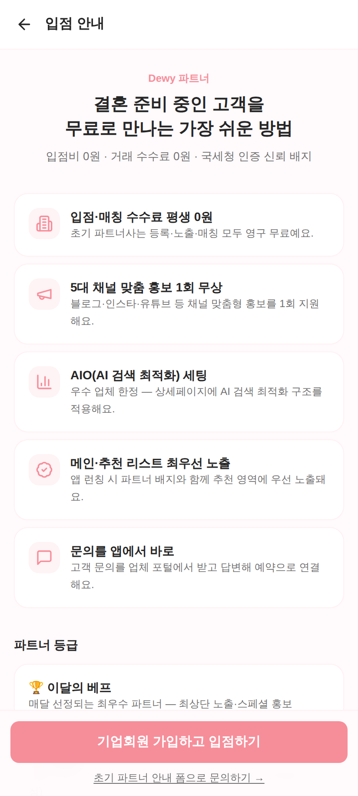
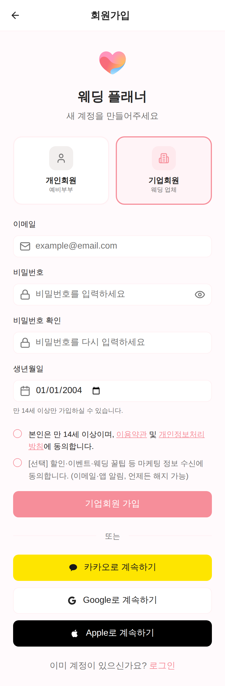
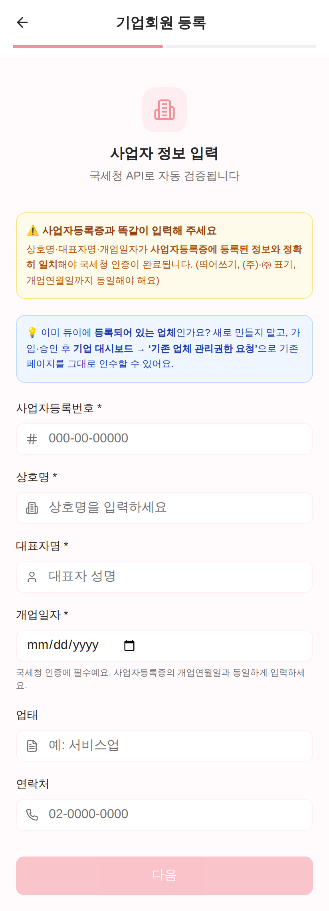
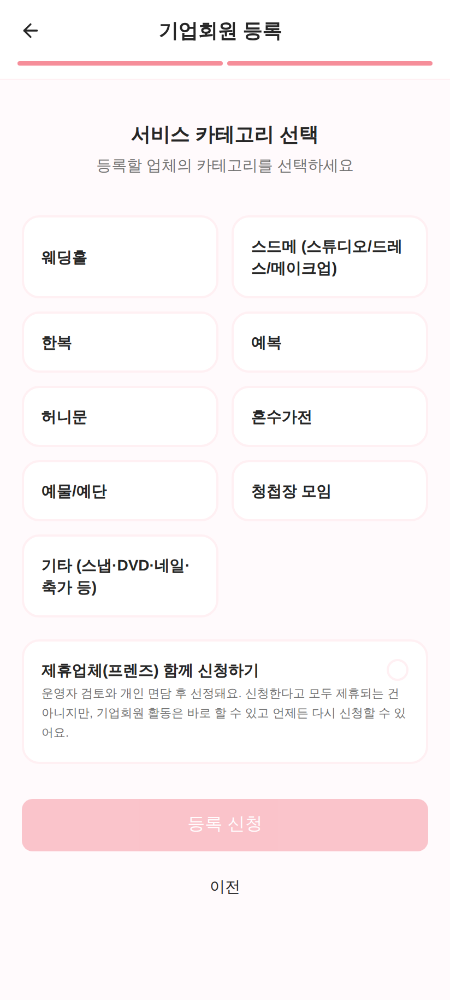
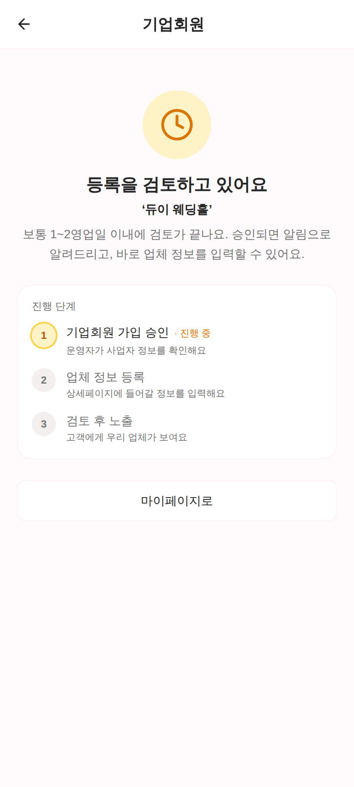
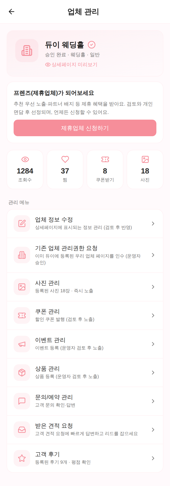
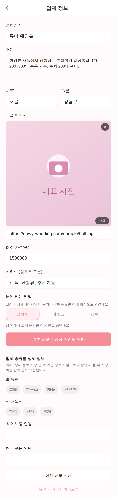
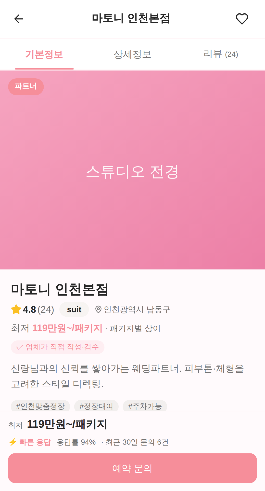
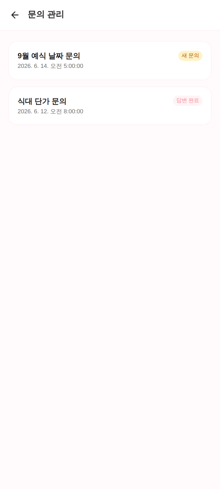
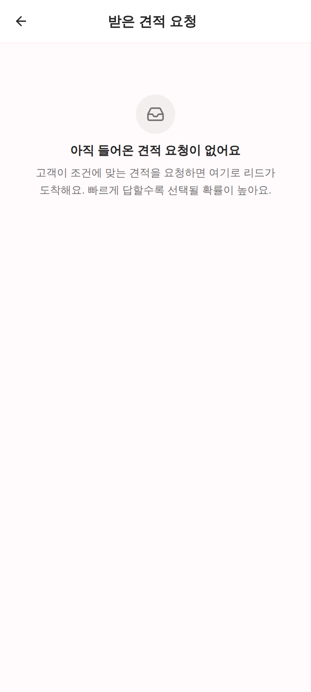

# 업체 사장님 가이드 — 가입부터 대시보드까지

> 듀이(Dewy)에 처음 입점하시는 웨딩 업체 사장님을 위한 **단계별 안내서**입니다.
> 화면은 실제 앱을 캡처한 것이며, 순서대로 따라 하시면 됩니다.
> (이 문서는 운영/CS 가 그대로 사장님께 전달할 수 있도록 만들어졌습니다.)

## 전체 흐름 한눈에 보기

```
①  기업회원 가입        →  ②  제휴(프렌즈) 신청     →  ③  업체 등록           →  ④  대시보드 사용
   (이메일·사업자 인증)      (선택 — 추천 우선노출)      (상세페이지 정보 입력)     (문의·견적·쿠폰 관리)
        │                         │                          │                        │
   운영자 승인 대기           검토 + 개인 면담            운영자 검토 후 노출         실시간 고객 응대
```

| 단계 | 무엇을 하나요 | 걸리는 시간 | 승인 필요? |
|------|--------------|-----------|-----------|
| ① 기업회원 가입 | 계정 만들고 사업자등록번호 인증 | 5분 | ✅ 운영자 승인 |
| ② 제휴 신청 | 프렌즈(제휴업체) 신청 (선택) | 1분 | ✅ 검토 + 면담 |
| ③ 업체 등록 | 상세페이지에 들어갈 정보 입력 | 10분 | ✅ 운영자 검토 |
| ④ 대시보드 사용 | 문의·견적 응대, 쿠폰·사진 관리 | 상시 | — |

> 💡 **승인 단계가 두 번 있어요.** "가입"하면 바로 모든 게 노출되는 게 아니라,
> ⓐ 기업회원 **가입 승인** → ⓑ 업체 정보 **검토 후 노출**, 두 관문을 거칩니다.
> 그래서 "가입했는데 왜 안 보이지?" 하는 분이 많은데, 정상입니다. 아래에서 설명드려요.

---

## ① 기업회원 가입

### 1-1. 입점 안내 페이지 열기

앱에서 **`/business`** (입점 안내) 페이지로 들어갑니다. 비로그인 상태에서도 볼 수 있어요.
- 비회원: 하단 메뉴/푸터의 **"웨딩 업체 사장님이신가요? 무료 입점 안내"**
- 이미 개인회원: **마이페이지 → 기업회원 전환**



맨 아래 분홍색 **`기업회원 가입하고 입점하기`** 버튼을 누릅니다.
(이미 개인 계정으로 로그인했다면 버튼이 **`기업회원 전환 신청하기`** 로 보입니다.)

### 1-2. 계정 만들기 (기업회원 선택)

회원가입 화면에서 **반드시 오른쪽 `기업회원(웨딩 업체)` 카드를 선택**하세요. (분홍 테두리로 강조됩니다.)
이메일·비밀번호·생년월일을 입력하고 약관에 동의한 뒤 **`기업회원 가입`** 을 누릅니다.
카카오/구글/애플 계정으로도 가입할 수 있어요.



> ⚠️ **개인회원으로 잘못 가입하면** 업체 관리 기능이 안 보입니다. 카드 선택을 꼭 확인하세요.
> 이미 잘못 가입했다면 마이페이지의 **기업회원 전환**으로 바꿀 수 있습니다.

### 1-3. 사업자 정보 입력 (국세청 자동 인증)

가입 후 자동으로 **기업회원 등록** 화면이 열립니다. 네 가지를 **사업자등록증과 똑같이** 입력하세요.



| 항목 | 설명 |
|------|------|
| **사업자등록번호** | `000-00-00000` 형식 (숫자만 입력하면 자동으로 `-` 가 들어갑니다) |
| **상호명** | 사업자등록증 상의 상호 그대로 (띄어쓰기·㈜ 표기까지 동일하게) |
| **대표자명** | 대표자 성명 |
| **개업일자** | 사업자등록증의 개업연월일과 **정확히** 동일하게 |
| 업태 / 연락처 | (선택) 입력하면 좋아요 |

> 🔎 **왜 똑같이 입력해야 하나요?** 입력값을 국세청 데이터와 자동 대조해 인증합니다.
> 상호·대표자명·개업일자 중 하나라도 다르면 인증이 실패할 수 있어요. **사업자등록증을 옆에 두고** 그대로 옮겨 적으세요.
>
> 💡 **이미 듀이에 우리 업체가 등록돼 있나요?** (예: 고객이 만든 페이지) 새로 만들지 말고,
> 가입·승인 후 대시보드의 **"기존 업체 관리권한 요청"** 으로 그 페이지를 인수하세요.

**`다음`** 을 누르면 카테고리 선택으로 넘어갑니다.

### 1-4. 서비스 카테고리 선택

우리 업체가 속한 카테고리를 고릅니다 (웨딩홀 / 스드메 / 한복 / 예복 / 허니문 / 혼수가전 / 예물·예단 / 청첩장 모임 / 기타).



맨 아래 **`제휴업체(프렌즈) 함께 신청하기`** 체크박스는 **②단계(제휴 신청)** 를 지금 같이 넣을지 묻는 것입니다.
지금 체크하지 않아도 나중에 대시보드에서 언제든 신청할 수 있으니 부담 없이 진행하세요.

**`등록 신청`** 을 누르면 가입이 접수됩니다.

### 1-5. 승인 대기 (중요!)

등록 신청을 마치면 **"등록을 검토하고 있어요"** 화면이 나옵니다. 이건 정상이에요.
화면의 **진행 단계**에서 지금 어디까지 왔는지(① 가입 승인 → ② 업체 정보 등록 → ③ 검토 후 노출) 한눈에 볼 수 있습니다.



**운영자가 검토 후 승인**하면(보통 1~2영업일 이내), 그때부터 업체 정보 입력·관리 기능이 열립니다.

> ⏳ 승인 전까지는 대시보드에 **상태 화면(검토 중)** 만 보입니다. 승인되면 알림으로 안내드려요.
> 반려된 경우 사유와 함께 **`다시 신청하기`** 버튼이 나타납니다.

---

## ② 제휴(프렌즈) 신청 — 선택

제휴(프렌즈)가 되면 **추천 리스트 우선 노출·파트너 배지** 등의 혜택을 받습니다.
일반 회원이라도 가입·활동은 바로 할 수 있고, 제휴는 **언제든** 신청할 수 있어요.

**신청 방법** — 승인된 뒤 대시보드 상단의 안내 카드에서 **`제휴업체 신청하기`** 를 누릅니다.



> ✅ **신청 조건**: 제휴는 업체 정보(업체명·카테고리·지역 시·구·소개·대표사진 6가지)를 **모두 채워야** 신청할 수 있어요.
> 빠진 항목이 있으면 버튼 대신 **`업체 정보 채우러 가기`** 가 보입니다 → 먼저 ③단계를 끝내세요.
>
> 📋 신청 후에는 **`검토 중` → `면담 진행 중` → 선정** 순으로 진행됩니다. 신청한다고 모두 제휴되는 건 아니며,
> 운영자 검토와 개인 면담을 거쳐 선정됩니다.

---

## ③ 업체 등록 (상세페이지 정보 입력)

승인되면 대시보드 → **`업체 정보 수정`** 에서 고객에게 보일 상세페이지 정보를 입력합니다.



| 항목 | 설명 |
|------|------|
| **업체명** | (필수) 상세페이지 제목 |
| 소개 | 강점·시설·수용인원 등을 구체적으로 |
| 시/도 · 구/군 | 지역 (검색·필터에 사용) |
| **대표 이미지** | 첫인상을 좌우하는 사진 — 꼭 등록하세요. 고객이 사진을 누르면 **풀스크린으로 크게** 보이니 고해상도로 올려주세요 |
| 최소가 · 시작가(원) | **목록·추천 카드의 `최저가~` 미리보기** + 검색·필터에 사용됩니다 (상세페이지 첫 화면 대표가격은 ❌ 아님 — 아래 💰 참고) |
| 키워드 | 쉼표로 구분 (예: `채플, 한강뷰, 주차가능`) |
| **문의 받는 방법** | `앱 내 문의` / `외부 링크` / `전화` 중 선택 — 고객이 연락하는 통로 |

입력 후 **`기본 정보 저장하고 검토 요청`** 을 누릅니다. 웨딩홀 등 일부 카테고리는
홀 유형·식대·보증인원 같은 **종류별 상세 정보** 칸이 추가로 나옵니다.

> ⏳ **저장하면 바로 노출되지 않습니다.** 저장 시 `검토 대기` 상태가 되고, 운영자 검토 후 상세페이지에 반영됩니다.
> (부적절·허위 정보가 그대로 노출되는 걸 막기 위한 단계예요.)
> 저장 후 **`상세페이지 미리보기`** 로 고객에게 어떻게 보이는지 직접 확인할 수 있습니다.

### ③-1. 내가 입력한 정보, 상세페이지에 이렇게 보입니다 (2026.06 개편)

상세페이지가 **고객이 첫 화면에서 "무엇·평판·어디·얼마·혜택"을 바로 판단**하도록 개편됐습니다.
사장님이 채우는 정보가 어디에 어떻게 노출되는지 알아두면 **무엇을 채워야 전환이 오르는지** 명확해집니다.



위 첫 화면 한 장에 **이름 → 평점·지역 → `최저 OOO만원~` → `✓ 업체가 직접 작성·검수` 배지 → 대표 사진**이
순서대로 담깁니다. 아래 표로 어떤 입력이 어디에 노출되는지 정리했습니다.

| 사장님이 입력 | 고객 화면에서 |
|--------------|--------------|
| **상품/패키지 가격** (상품 관리) | **상세페이지** 첫 화면 상단 + 하단 고정바에 **`최저 OOO만원~`** 으로 크게 노출 ✨ |
| 최소가·시작가 (업체 정보) | **목록·추천 카드**의 `최저가~` 미리보기 + 검색·필터 (상세페이지 첫 화면 가격은 아님) |
| 대표 이미지·갤러리 사진 | 맨 위 큰 사진 → 탭하면 **풀스크린 스와이프 갤러리**(`전체 N장`) |
| 쿠폰 (쿠폰 관리) | 첫 화면 **혜택군에 바로(above-fold)** 노출 — 스크롤 없이 보임 |
| 소개·키워드·지역·평점 | 업체명 바로 아래 한 줄 요약 (평점·카테고리·지역) + 설명 |
| 종류별 상세 정보 | `상세정보` 탭 (예전 "디테일정보") |

> 💰 **가격 칸이 두 군데라 헷갈리기 쉬워요 — 노출 위치가 다릅니다.**
> - **상세페이지 첫 화면**의 큰 가격(`최저 OOO만원~`) = **[상품 관리]의 패키지 가격**. 패키지가 하나도 없으면 `가격은 문의로 안내해드려요` 로 뜹니다.
> - **[업체 정보 수정]의 "최소가·시작가"** = **목록·추천 카드**의 `최저가~` 미리보기 + 검색·필터용. (상세페이지 첫 화면엔 안 나옵니다.)
> - 👉 **둘 다 채우는 걸 권장**: 카드에서 눈에 띄고(최소가) + 상세에서 신뢰를 주려면(상품 패키지) 양쪽 모두 필요합니다.
>
> 🏅 **`✓ 업체가 직접 작성·검수` 배지** — 사장님 계정으로 직접 정보를 채우고 운영자 검토를 통과하면,
> 상세페이지에 이 **신뢰 배지**가 붙습니다. (고객이 만든 페이지를 인수만 하고 방치하면 안 붙어요 → 직접 채우세요.)

---

## ④ 대시보드 사용

대시보드(**업체 관리**)는 모든 기능의 중심입니다. 상단에 업체 프로필·통계(조회수·찜·쿠폰·사진)가 보이고,
아래 **관리 메뉴**에서 각 기능으로 들어갑니다.


### 관리 메뉴 한눈에

| 메뉴 | 하는 일 | 노출 방식 |
|------|--------|----------|
| **업체 정보 수정** | 상세페이지 정보 관리 (③단계) | 검토 후 반영 |
| **기존 업체 관리권한 요청** | 이미 듀이에 있는 우리 업체 페이지 인수 | 운영자 승인 |
| **사진/메뉴 관리** | 갤러리 사진(또는 메뉴) 업로드 | ⚡ **즉시 노출** |
| **쿠폰 관리** | 할인 쿠폰 발행 | 검토 후 노출 |
| **이벤트 관리** | 프로모션 이벤트 등록 | 검토 후 노출 |
| **상품 관리** | 상품/패키지 등록 (상세페이지 첫 화면 `최저 OOO만원~` 가격의 출처) | 검토 후 노출 |
| **문의/예약 관리** | 고객 문의 확인·답변 | — |
| **받은 견적 요청** | 고객 견적 요청에 응답 | — |
| **결과물 보내기** | 보정본 등 결과물을 고객에게 전달 | — |
| **고객 후기** | 후기·평점 확인 | — |

> 일부 메뉴는 **카테고리에 따라** 다르게 보입니다 (예: 사진관·스튜디오는 "메뉴 관리" 대신 "사진 관리",
> 청첩장 디자인 판매 업체는 "디자인 등록"이 추가될 수 있어요).

### 4-1. 문의/예약 관리

고객이 보낸 문의가 목록으로 쌓입니다. **새 문의**(노란 배지)를 눌러 내용을 확인하고 답변하면 **답변 완료**로 바뀝니다.



> 💬 빠른 답변이 예약 전환의 핵심입니다. 새 문의 배지가 보이면 가능한 빨리 응대하세요.

### 4-2. 받은 견적 요청 (리드)

고객이 조건(지역·예산·날짜 등)에 맞춰 견적을 요청하면 여기로 **리드**가 도착합니다.
빠르게 답할수록 고객에게 선택될 확률이 높아요. (아직 요청이 없으면 아래처럼 빈 화면이 보입니다.)



각 요청을 열어 **가격대·메시지**를 담아 응답하면, 고객이 수락 시 **연락처가 공개되고 인앱 채팅**으로 연결됩니다.

### 4-3. 쿠폰·사진·이벤트·상품

- **사진/메뉴**: 업로드하면 검토 없이 **즉시** 노출 → 갤러리를 채울수록 신뢰도가 올라갑니다.
  고객이 사진을 누르면 **풀스크린으로 크게** 보이니 여러 장·고해상도로 올리세요.
- **쿠폰**: 할인 쿠폰을 발행합니다 (운영자 검토 후 노출 · 보통 1영업일 이내).
  개편 후 쿠폰은 상세페이지 **첫 화면 혜택군(above-fold)** 에 바로 노출돼 **문의 전환에 직접 기여**합니다 → 적극 활용하세요.
- **상품/패키지**: 가격과 함께 등록하면 상세페이지 **첫 화면·하단바에 `최저 OOO만원~`** 으로 노출됩니다(③-1 💰 참고).
- **이벤트**: 시즌 프로모션을 등록 (검토 후 노출).

---

## 자주 막히는 부분 (FAQ)

| 증상 | 원인 / 해결 |
|------|------------|
| **업체 관리 메뉴가 안 보여요** | 개인회원으로 가입했을 가능성 → 마이페이지 **기업회원 전환**. 또는 아직 가입 승인 전(검토 중). |
| **가입했는데 상세페이지가 고객에게 안 보여요** | 승인은 2단계예요 → ⓐ 기업회원 승인 + ⓑ 업체 정보 **검토 후 노출**. ③단계 저장 후 운영자 검토를 기다리세요. |
| **사업자 인증이 자꾸 실패해요** | 상호·대표자명·**개업일자**를 사업자등록증과 글자 하나까지 동일하게. 띄어쓰기·㈜ 표기도 확인. |
| **"검토 중" 화면에서 멈춰 있어요** | 정상입니다. 화면의 **진행 단계**로 현재 위치를 확인하세요. 보통 1~2영업일 내 승인되며, 승인되면 자동으로 대시보드가 열립니다. |
| **제휴 신청 버튼이 없어요** | ③ 업체 정보 6개 필수항목을 모두 채워야 신청 버튼이 활성화됩니다(`업체 정보 채우러 가기`). |
| **저장했는데 바뀐 정보가 상세페이지에 없어요** | 정보 수정은 **검토 후 반영**됩니다(사진만 즉시 노출). 검토를 기다려 주세요. |
| **첫 화면에 가격이 `문의로 안내`로만 떠요** | 상세페이지 첫 화면 대표 가격은 **[상품 관리]의 패키지 가격**에서 나옵니다 → 가격을 넣은 상품/패키지를 1개 이상 등록하세요(③-1 💰). [업체 정보]의 "최소가·시작가" 칸은 **목록 카드·검색·필터용**이라 첫 화면엔 안 나옵니다. |
| **`✓ 직접 작성·검수` 배지가 안 붙어요** | 사장님 계정으로 **직접 정보를 채우고** 운영자 검토를 통과해야 붙습니다. 인수만 하고 비워두면 안 붙어요. |
| **이미 우리 업체가 듀이에 있어요** | 새로 만들지 말고 **기존 업체 관리권한 요청**으로 인수하세요. |

---

## 승인/노출 규칙 요약

```
[가입]   기업회원 가입 신청 ──운영자 승인──▶ 대시보드 사용 가능
[정보]   업체 정보 저장 ──운영자 검토──▶ 상세페이지 노출
[제휴]   프렌즈 신청 ──검토+면담──▶ 프렌즈 선정 (우선 노출)
[사진]   업로드 ──즉시──▶ 노출
[쿠폰·이벤트·상품]  등록 ──운영자 검토──▶ 노출
```

문의는 앱 내 **1:1 문의** 또는 운영자에게 연락 주세요. 입점을 환영합니다! 🎉

---

<sub>※ 이 가이드의 화면은 실제 앱을 캡처한 것입니다. 일부 대시보드 화면은 데모용 샘플 데이터(업체명·통계·문의 내용)로 표시되어 있으며, 실제 사장님 화면에는 본인 업체의 데이터가 나타납니다.</sub>
