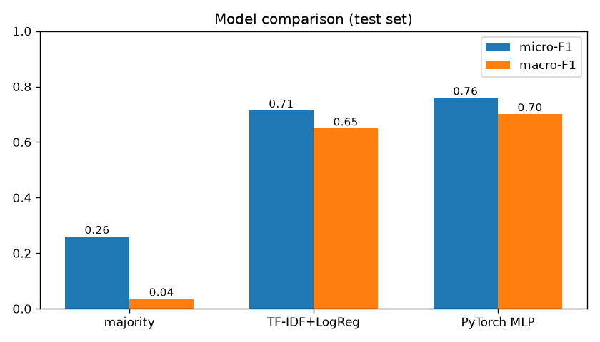
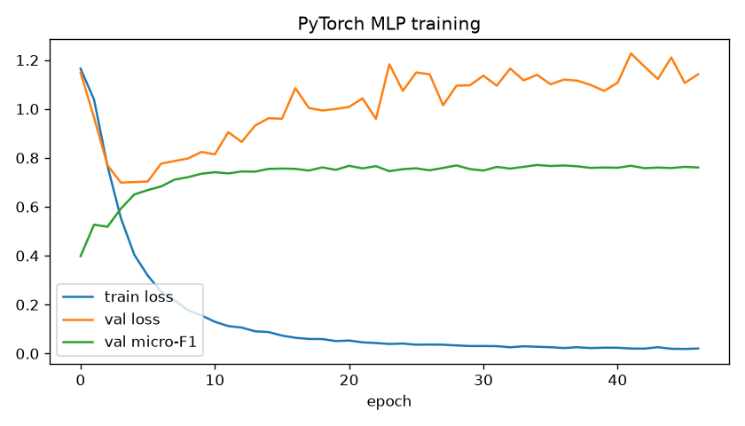
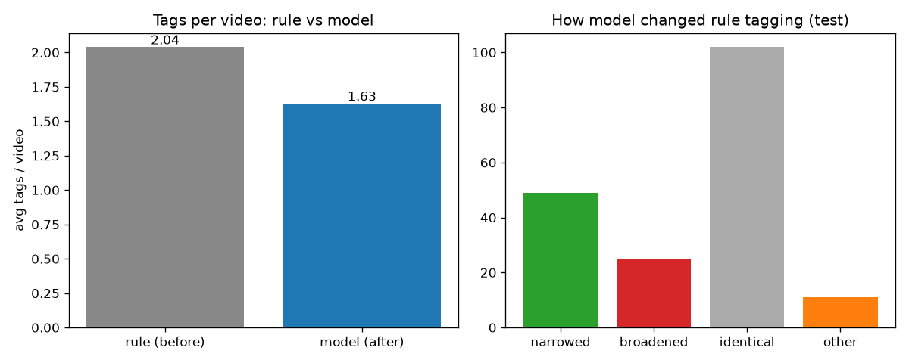

<!-- _class: lead -->

# 웨딩 팁영상 토픽 분류기
## 규칙 기반(정규식) → 딥러닝 멀티라벨 분류

실 서비스(Dewy) 데이터로 학습·평가한 NLP 텍스트 분류 실습

<small>PyTorch MLP · 실데이터 1,242건 · micro-F1 0.76</small>

---

# 1. 배경 — 실제 앱의 부품을 교체한다

- Dewy(웨딩 준비 앱)는 유튜브 팁영상을 16개 토픽으로 분류해 보여준다.
- 현재 분류기 `src/lib/tipClassify.ts` = **정규식 규칙**(키워드 매칭).
- 한계: **명시된 키워드에만 반응** → 표현이 다르거나, 설명문에 키워드가
  잔뜩 박힌 영상에서 **과다/누락 태깅**.
- 💡 실습 목표: 이 규칙 부품을 **직접 학습한 신경망**으로 교체하고,
  규칙·얕은 ML·딥러닝을 **같은 데이터로 정량 비교**한다.

> 별도 데이터 수집 없이 앱 DB(`tip_videos`)를 그대로 재사용 — 실무형 셋업.

---

# 2. 문제 정의

- **태스크**: 영상 텍스트 → 토픽 분류 (**멀티라벨** — 한 영상이 여러 토픽)
- **입력**: `제목 + 설명 + 태그 + 채널명` (규칙기와 동일 구성)
- **16 토픽**: 웨딩홀·스튜디오·드레스·메이크업·한복·예복·허니문·예단예물·
  상견례·신혼집·가전·청첩장·신부관리·예식·혼인신고·일반
- **평가지표**: micro-F1 / macro-F1 (멀티라벨 표준)

---

# 3. 데이터 — 실 서비스 1,242건

- 출처: Supabase `tip_videos` (앱이 수집한 실제 유튜브 영상 메타)
- 라벨: 기존 **규칙 출력**(`categories`) = *약한 라벨(weak label)*
- 영상당 평균 **1.98개** 라벨, off-topic(라벨 0개) 181건
- **클래스 불균형**(꼬리가 김):

| 다수 | ceremony 515 · studio 257 · dress_shop 220 · bridal_care 200 |
|---|---|
| **소수** | legal_paperwork 57 · **general 15** |

> 불균형은 학습에 `pos_weight`로 보정, 평가는 macro-F1 으로 소수 클래스까지 본다.

---

# 4. 방법 — 파이프라인

```
텍스트  →  TF-IDF 특징                →  PyTorch MLP        →  16-way sigmoid
          · word 1–2gram (2만)            · 512 → 128 hidden     (멀티라벨)
          · char 2–4gram (2만, 한국어     · ReLU + Dropout 0.3
            형태 견고)  = 26,767 dim       · BCEWithLogitsLoss
                                            (pos_weight 불균형 보정)
                                          · Adam, early stopping
```

- 한국어 형태소 분석기 없이 **문자 n-gram**으로 조사·변형·오타에 견고.
- 사전학습 트랜스포머 미사용(환경 제약) → **처음부터 학습한 신경망**.
  (KLUE-RoBERTa 파인튜닝 노트북은 별도 준비 — §9)

---

# 5. 실험 설계 — 공정 비교

- 동일 split: **train 869 / val 186 / test 187** (seed 고정)
- 세 모델을 **같은 특징·같은 분할**로 비교:

| 모델 | 종류 |
|---|---|
| Majority | 최빈 라벨만 예측(하한선) |
| TF-IDF + LogReg | 얕은 ML(One-vs-Rest) |
| **PyTorch MLP** | **딥러닝(본 실습)** |

- 임계값은 **val에서 튜닝**(0.55) 후 test에 적용 — 누수 차단.

---

# 6. 결과 — 딥러닝이 이긴다



| 모델 | micro-F1 | macro-F1 |
|---|---|---|
| Majority | 0.260 | 0.035 |
| TF-IDF + LogReg | 0.715 | 0.649 |
| **PyTorch MLP** | **0.760** | **0.701** |

→ 딥러닝이 얕은 ML 대비 **micro +4.5 / macro +5.2** 포인트.

---

# 7. 왜 이겼나 — precision/recall 구조

| 모델 | precision | recall |
|---|---|---|
| TF-IDF + LogReg | **0.948** | 0.573 |
| PyTorch MLP | 0.856 | **0.683** |

- LogReg는 **보수적**(확실할 때만 예측) → 정밀도 높지만 **놓침 많음**.
- MLP는 특징 조합을 학습해 **재현율을 크게 끌어올림**(0.57→0.68) →
  F1 우위. 멀티라벨에선 **놓친 라벨을 줄이는 게** 핵심.

---

# 8. 학습 곡선



- val loss 최저점에서 **early stopping**(47 epoch) → 과적합 차단.
- val micro-F1 이 안정적으로 수렴.

---

# 9. 클래스별 성능 — 강점과 사각지대

| 잘 맞춤 | F1 | 어려움 | F1 |
|---|---|---|---|
| legal_paperwork | 0.875 | **general** | **0.00** |
| ceremony | 0.846 | appliance | 0.64 |
| dress_shop | 0.806 | wedding_gifts | 0.61 |

- **legal_paperwork**: 어휘가 고유(혼인신고·디딤돌대출) → 쉽게 학습.
- **general**: train 15건뿐 + 의미가 모호 → **데이터 기아로 학습 실패**.
  (소수·모호 클래스의 전형적 한계)

---

# 10. 핵심 인사이트 — 규칙의 과다태깅을 모델이 교정

test 187건 중 85건에서 규칙과 모델이 **불일치**. 대표 사례:

> **"결혼 준비 월별 체크리스트 … 지출 타이밍 공개"**
> · 규칙: `ceremony, dress_shop, hanbok, honeymoon, invitation_venue,
>   newlywed_home, studio, tailor_shop, wedding_gifts, wedding_hall` (**10개!**)
> · 모델: `ceremony` (1개)

- 설명문에 키워드가 많다고 **전부 그 토픽이 아니다** — 규칙은 과다태깅,
  모델은 **문맥으로 핵심만** 선택.
- 반대로 모델 약점도: 희소 토픽(상견례 일부)은 **놓치기도** 함(정직한 한계).

---

# 11. 적용 전 / 후 — 정량 비교



- 영상당 평균 태그: **규칙 2.04개 → 모델 1.63개** (군더더기 정제)
- test 187건 중 모델이 **좁힘 49 · 동일 102 · 넓힘 25** · 과다태그 **121개 제거**
- 예: "알뜰하게 결혼하기 총 결산…서울 웨딩홀" — 규칙 **10개 토픽** → 모델 `ceremony` 하나

---

# 12. 한계 (정직하게)

1. **약한 라벨 천장**: 정답이 규칙 출력 → 모델은 규칙을 *일반화*할 뿐,
   "규칙보다 정확함"의 엄밀 증명엔 **사람 손라벨(gold) 필요**(미수행).
2. **데이터 규모·불균형**: 1,242건, general 15건 → 소수 클래스 부진.
3. **사전학습 미활용**: 환경상 트랜스포머 다운로드 차단 → MLP로 대체.
4. 평가셋 187건 → 신뢰구간 넓음.

---

# 13. 향후 — 확장 경로 (준비 완료)

- **KLUE-RoBERTa 파인튜닝**: `train_classifier.ipynb` 작성 완료,
  GPU(Colab)에서 바로 실행 → 문맥 이해로 추가 향상 기대.
- **사람 gold 200건**: `export_tip_videos.py --make-gold-template` 로
  손라벨 → "모델 vs 규칙" 진짜 비교.
- **앱 연동**: 모델이 규칙을 이기면 배치 reclassify 로 `tip_videos.categories`
  갱신(별도 PR).

---

<!-- _class: lead -->

# 14. 결론

- 실 서비스 데이터 1,242건으로 **규칙 → 딥러닝** 교체 실험을 끝까지 수행.
- **PyTorch MLP가 얕은 ML·규칙 대비 우위**(micro 0.76, macro 0.70).
- 정성 분석으로 **규칙의 과다태깅을 모델이 교정**함을 확인.
- 재현 가능: `python train_local.py` → `results/`(지표·차트) 자동 생성.

**감사합니다 — 질문 환영합니다.**
